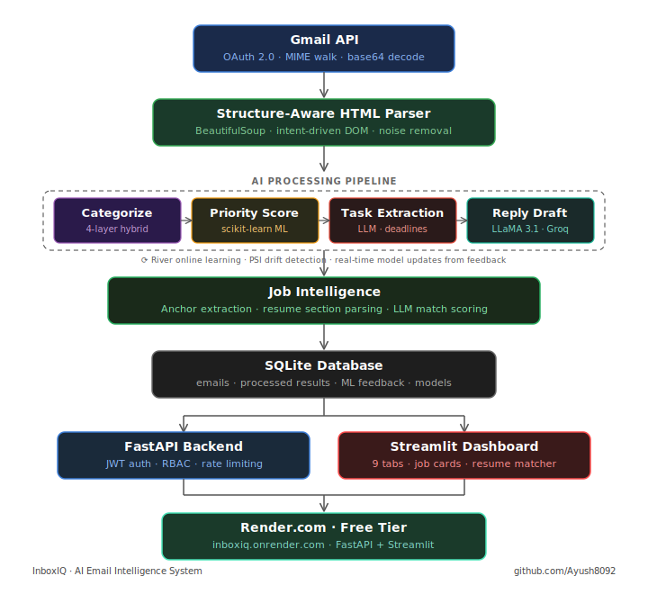

# InboxIQ — AI Email Intelligence System


**An autonomous AI agent that reads, understands, categorizes, and acts on your emails — so you don't have to.**

[Live Demo](https://inboxiq-36l0.onrender.com) · [API Docs](https://inboxiq.onrender.com:8000/docs) · [Report Bug](https://github.com/Ayush8092/InboxIQ-AI-Email-Intelligence-System/issues)

</div>

---

## The Problem

The average professional spends **2.5 hours per day** on email. Most of that time is not reading — it is deciding: *Is this urgent? What do I need to do? How do I reply?*

InboxIQ solves this by connecting directly to Gmail and running every email through an intelligent pipeline that answers those three questions automatically, in seconds.

---

## What It Does

| Feature | Description |

**Auto-Categorization** - Classifies every email into 9 categories (Job, Finance, Newsletter, Action Required, etc.) using a 4-layer hybrid pipeline |     
**Priority Scoring** - Scores each email 1–7 using a trained ML model with 10 engineered features |     
**Task Extraction** - Pulls out actionable tasks with deadlines from email content |     
**Reply Drafts** - Generates context-aware, ready-to-send reply drafts |     
**Smart Summaries** - One-line summaries for every email |     
**Job Intelligence** - Extracts all job listings from recruitment emails + matches against your resume |     
**Resume Matching** - Section-aware resume parsing + semantic job-fit scoring with skill gap analysis |     
**Online Learning** - ML model updates in real time from your feedback — gets smarter as you use it |     
**Analytics Dashboard** - Category trends, priority distribution, cache hit rates, drift detection |     

---

## Architecture

<div align="center">
  
</div>


## Tech Stack

**Backend**
- Python 3.11, FastAPI, Uvicorn
- Groq API (LLaMA 3.1 8B Instant) for all LLM tasks
- scikit-learn 1.4 for ML priority scoring
- River for online/incremental learning
- SQLite with custom migration system

**Frontend**
- Streamlit 1.35 (9-tab dashboard)
- Custom HTML/CSS components

**Security**
- Google OAuth 2.0 with PKCE state validation
- JWT access + refresh tokens (15min / 7-day)
- Fernet AES-128 encrypted token storage
- Rate limiting with in-memory sliding window
- All sensitive data masked in logs

**Infrastructure**
- Deployed on Render.com (free tier)
- In-memory LLM response caching (40–60% API call reduction)
- Circuit breaker pattern on external dependencies

---

## Project Structure

```
InboxIQ/
├── ui/
│   ├── app.py                 # Main entry — 9 tabs
│   ├── inbox_tab.py           # Email processing + feedback
│   ├── categorized_tab.py     # Category browser + job cards
│   ├── job_task_tab.py        # Resume upload + job matching
│   ├── dashboard_tab.py       # Charts and summaries
│   ├── ml_insights_tab.py     # Model drift + online learning
│   └── ...7 more tabs
├── utils/
│   ├── email_cleaner.py       # DOM-aware HTML → structured data
│   ├── oauth.py               # Gmail OAuth + MIME extraction
│   ├── secure_logger.py       # PII-masked logging
│   └── encryption.py         # Fernet token encryption
├── tools/
│   ├── categorize.py          # 4-layer categorization
│   ├── extract_tasks.py       # LLM task extraction
│   └── summarize.py           # LLM summarization
├── services/
│   ├── job_service.py         # Job card extraction + matching
│   ├── ml_service.py          # scikit-learn pipeline
│   ├── online_learning.py     # River incremental model
│   └── drift_detector.py      # PSI + concept drift
├── api/
│   ├── routes.py              # FastAPI endpoints + RBAC
│   └── auth.py                # JWT + token blacklist
├── memory/
│   ├── db.py                  # SQLite init + migrations
│   └── repository.py          # CRUD operations
├── data/
│   └── mock_inbox.json        # 20 demo emails
├── start.sh                   # Runs FastAPI + Streamlit together
└── requirements.txt
```

---

## Key Engineering Decisions

**1. Structure-Aware Email Parsing**

Standard email parsers flatten HTML to text using `soup.get_text()`, which destroys the layout of emails like Glassdoor job alerts. Instead, InboxIQ uses an intent-driven DOM traversal — it finds `<a>` tags whose text matches job title patterns (the intent anchor), then reads only the parent `<td>.strings` as a limited context window. This extracts company, location, salary, and skills per job card without any text noise.

**2. Hybrid Categorization Pipeline**

A pure LLM approach is expensive and slow for every email. InboxIQ uses 4 layers:
1. **Rule override** — regex on sender domain and subject keywords (instant)
2. **LLM** — Groq LLaMA 3.1 for ambiguous cases (fast, ~200ms)
3. **LLM retry** — with a stricter prompt if first attempt returns invalid category
4. **Heuristic fallback** — keyword scoring ensures no email is left uncategorized

**3. Section-Aware Resume Parsing**

Most resume parsers scan the entire document and hallucinate. InboxIQ splits the resume into sections (EDUCATION, EXPERIENCE, SKILLS, PROJECTS) using regex on section headers, then sends each section to a targeted LLM prompt. Experience years are calculated from actual date ranges (`May 2025 – August 2025 = 3 months`), not inferred from descriptions.

**4. Online Learning**

Every time a user corrects a priority score, the correction feeds into a River incremental learning pipeline that updates the model weights immediately. A PSI-based drift detector monitors whether recent email patterns diverge from training data and triggers retraining when needed.

---

## Getting Started

### Prerequisites
```
Python 3.11+
Google Cloud project with Gmail API enabled
Groq API key (free tier works)
```

### Local Setup

```bash
# 1. Clone the repo
git clone https://github.com/Ayush8092/InboxIQ-AI-Email-Intelligence-System
cd InboxIQ-AI-Email-Intelligence-System

# 2. Install dependencies
pip install -r requirements.txt

# 3. Set environment variables
cp .env.example .env
# Fill in: GROQ_API_KEY, GOOGLE_CLIENT_ID, GOOGLE_CLIENT_SECRET, etc.

# 4. Run
bash start.sh
# Streamlit → http://localhost:8501
# FastAPI   → http://localhost:8000/docs
```

### Environment Variables

| Variable | Description |
|---|---|
| `GROQ_API_KEY` | Groq API key for LLaMA 3.1 |
| `GOOGLE_CLIENT_ID` | Google OAuth client ID |
| `GOOGLE_CLIENT_SECRET` | Google OAuth client secret |
| `OAUTH_REDIRECT_URI` | OAuth callback URL |
| `AEOA_ENCRYPTION_KEY` | Fernet key for token encryption |
| `JWT_SECRET` | JWT signing secret |
| `DB_PATH` | SQLite database path |

---

## Live Demo

The demo runs on Render free tier — it may take ~30 seconds to wake up on first visit.

**Demo mode** (no login required): Loads 20 pre-processed emails across all categories so you can explore every feature immediately.

**Gmail mode** (sign in with Google): Connects to your real inbox and processes your actual emails live.

🔗 **[https://inboxiq.onrender.com](https://inboxiq.onrender.com)**

---

## Dashboard Preview

| Tab - What You See |

Inbox - All emails with category, priority badge, task, and summary
Categorized - Filter by category — job emails show structured job cards with Apply buttons
Job Task - Upload resume → extract jobs → get scored match % per listing
Dashboard - Category distribution, priority histogram, key metrics
ML Insights - Model accuracy, drift detection, online learning feed
Drafts - AI-generated reply drafts for every email

---

## What I Learned

- Building a real OAuth flow end-to-end (not just using a library)
- Why `soup.get_text()` fails on real-world HTML and how to fix it
- The difference between rule-based and semantic categorization — and when to use each
- How to deploy a multi-process app (FastAPI + Streamlit) on a free-tier server
- Incremental ML with River and why it matters for personalized systems

---

## Author

**Ayush Kumar**
B.Tech Computer Science, VIT Bhopal
[GitHub](https://github.com/Ayush8092) · [LinkedIn](https://linkedin.com/in/ayush-kumar)

---

<div align="center">
⭐ If this project helped you or impressed you, consider giving it a star.
</div>
